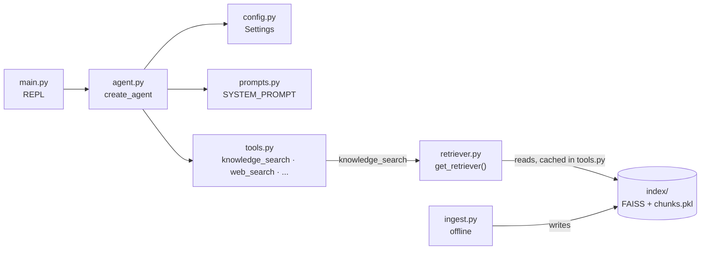
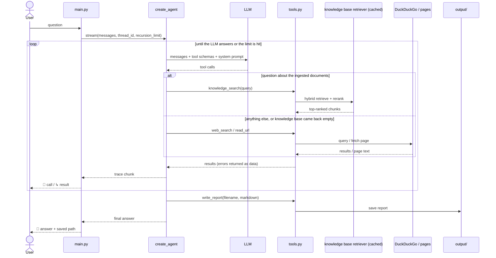
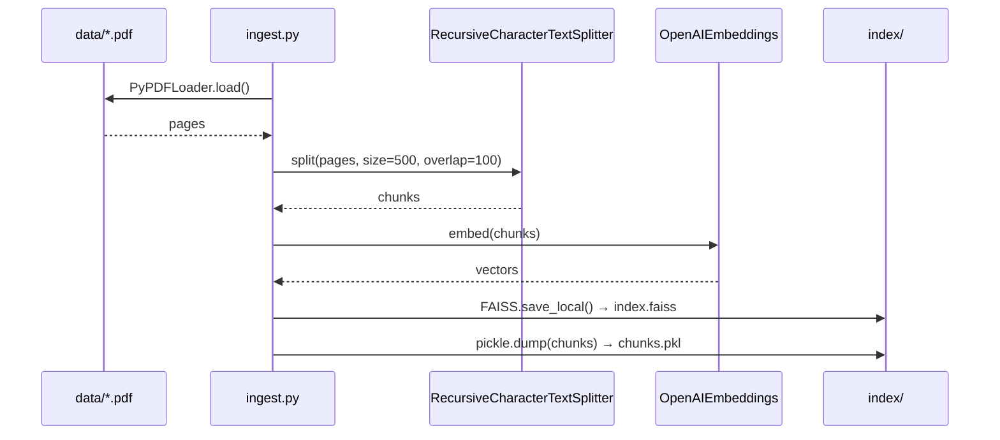
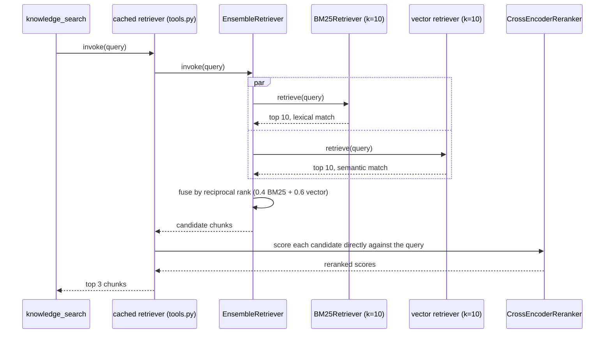

# Research Agent (RAG)

An agent that takes a question, researches it using a local knowledge base and/or
the web, and produces a structured Markdown report. Extends the base Research
Agent with a `knowledge_search` tool: hybrid retrieval (BM25 + semantic) with
cross-encoder reranking over PDFs ingested into a local FAISS index. Built with
LangChain `create_agent`, with conversation memory via `InMemorySaver`.

## Setup

```bash
python3 -m venv .venv
source .venv/bin/activate
pip install -r requirements.txt
cp .env.example .env
# fill in OPENAI_API_KEY in .env
```

Build the knowledge base index (once, or whenever `data/` changes):

```bash
python ingest.py
```

Loads every PDF in `data/`, chunks it, embeds the chunks, and saves a FAISS index
plus a pickled chunk list to `index/` (gitignored — regenerate it, don't commit it).
Drop additional PDFs into `data/` and re-run to extend the knowledge base.

## Run

`.venv` must be activated in the current shell (re-run `source .venv/bin/activate`
in every new terminal — it does not persist across sessions):

```bash
source .venv/bin/activate && python main.py
```

Interactive mode: enter a question, watch the tool-call trace, and the agent saves
the report to `output/`. Type `exit` to quit.

## Architecture



The agent decides which tools to call and in what order — no sequence is hardcoded,
including the choice between the local knowledge base and the open web. `main.py`
only supplies the `thread_id` (so the checkpointer links turns into one conversation)
and the `recursion_limit` that caps how far the loop may run.

## Flow



## Tools

| Tool | Purpose |
|---|---|
| `knowledge_search` | Hybrid search + rerank over the ingested PDF knowledge base |
| `web_search` | DuckDuckGo search; returns `title` / `url` / `snippet` |
| `read_url` | Full page text via trafilatura, paged with `offset` |
| `write_report` | Save a Markdown report to `output/` |
| `list_files` | List previously saved reports |
| `read_file` | Read a saved report back, paged with `offset` |

`list_files` and `read_file` exist so the agent can extend a report it wrote
earlier instead of overwriting it blindly — the multi-turn case where the user
says "now add a section about X".

The system prompt tells the agent to try `knowledge_search` first for questions
about the ingested documents, and fall back to `web_search`/`read_url` for
anything else — or if the knowledge base comes back empty. Both can be used in
the same turn (e.g. "compare what the knowledge base says with the current
state of the art").

## Knowledge base (RAG)

Ingestion runs offline, once (or whenever `data/` changes):



Every `knowledge_search` call queries the already-built index through this
pipeline (see Cost note below for why the retriever itself is cached, not
rebuilt per call):



## Context engineering

- Page text and saved reports are returned in bounded chunks, so one tool result
  cannot flood the context window.
- Each truncated chunk reports the offset to continue from, so no content becomes
  unreachable — the guardrail limits how much arrives at once, not how much is
  reachable in total.
- Tool errors are returned as data, never raised: the agent sees the failure in
  context and can retry with different arguments or move on.
- `filename` arrives from the model, so path components are stripped before any
  file is opened.

## Configuration

`config.py` holds settings; `prompts.py` holds the system prompt and report
template. Secrets are read from `.env` (template — `.env.example`) and never
committed.

| Setting | Default | Meaning |
|---|---|---|
| `model_name` | `gpt-5.2` | Chat model |
| `max_search_results` | `5` | Upper bound on search results per call |
| `max_url_content_length` | `5000` | Characters per `read_url` chunk |
| `max_file_content_length` | `10000` | Characters per `read_file` chunk |
| `request_timeout` | `20` | Page download timeout, seconds |
| `llm_timeout` | `60` | LLM call timeout, seconds (SDK default is 600 — fail fast instead) |
| `max_iterations` | `25` | Tool-calling rounds before the run is cut off |
| `output_dir` | `output` | Where reports are written |
| `embedding_model` | `text-embedding-3-small` | Embedding model for ingestion and query |
| `data_dir` | `data` | Where source PDFs live |
| `index_dir` | `index` | Where the FAISS index and `chunks.pkl` are saved (gitignored) |
| `chunk_size` | `500` | Characters per chunk |
| `chunk_overlap` | `100` | Character overlap between adjacent chunks |
| `retrieval_top_k` | `10` | Candidates pulled by each retriever (BM25, vector) before fusion |
| `rerank_top_n` | `3` | Chunks kept after cross-encoder reranking |

## Example output

`example_output/report.md` — a real generated report.
