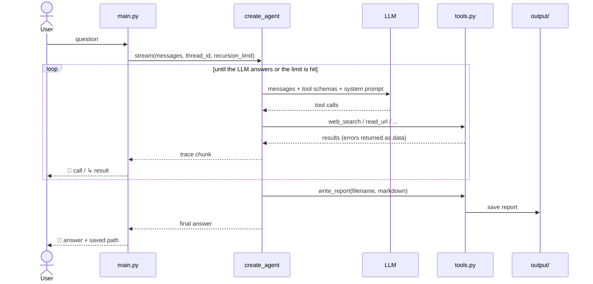

# Research Agent

An agent that takes a question, researches it on the web using its own tools, and
produces a structured Markdown report. Built with LangChain `create_agent`, with
conversation memory via `InMemorySaver`.

## Setup

```bash
python3 -m venv .venv
source .venv/bin/activate
pip install -r requirements.txt
cp .env.example .env

fill in OPENAI_API_KEY in .env
```

## Run

`.venv` must be activated in the current shell (re-run `source .venv/bin/activate`
in every new terminal — it does not persist across sessions):

```bash
source .venv/bin/activate && python main.py
```

Interactive mode: enter a question, watch the tool-call trace, and the agent saves
the report to `output/`. Type `exit` to quit.

## Architecture

```
main.py     REPL — reads input, streams the run, prints the tool trace
   │
agent.py    create_agent(model, tools, system_prompt, checkpointer)
   │
   ├─ config.py    Settings (Pydantic)
   ├─ prompts.py   SYSTEM_PROMPT, REPORT_TEMPLATE
   └─ tools.py     web_search · read_url · write_report · list_files · read_file
```

The agent decides which tools to call and in what order — no sequence is hardcoded.
`main.py` only supplies the `thread_id` (so the checkpointer links turns into one
conversation) and the `recursion_limit` that caps how far the loop may run.

## Flow



## Tools

| Tool | Purpose |
|---|---|
| `web_search` | DuckDuckGo search; returns `title` / `url` / `snippet` |
| `read_url` | Full page text via trafilatura, paged with `offset` |
| `write_report` | Save a Markdown report to `output/` |
| `list_files` | List previously saved reports |
| `read_file` | Read a saved report back, paged with `offset` |

`list_files` and `read_file` exist so the agent can extend a report it wrote
earlier instead of overwriting it blindly — the multi-turn case where the user
says "now add a section about X".

## Context engineering

- Page text and saved reports are returned in bounded chunks, so one tool result
  cannot flood the context window.
- Each truncated chunk reports the offset to continue from, so no content becomes
  unreachable — the guardrail limits how much arrives at once, not how much is
  reachable in total.
- Tool errors are returned as data, never raised: the agent sees the failure in
  context and can retry with different arguments or move on.
- `filename` arrives from the model, so path components are stripped before any
  file is opened.

## Configuration

`config.py` holds settings; `prompts.py` holds the system prompt and report
template. Secrets are read from `.env` (template — `.env.example`) and never
committed.

| Setting | Default | Meaning |
|---|---|---|
| `model_name` | `gpt-5-mini` | Chat model |
| `max_search_results` | `5` | Upper bound on search results per call |
| `max_url_content_length` | `5000` | Characters per `read_url` chunk |
| `max_file_content_length` | `10000` | Characters per `read_file` chunk |
| `request_timeout` | `20` | Page download timeout, seconds |
| `max_iterations` | `25` | Tool-calling rounds before the run is cut off |
| `output_dir` | `output` | Where reports are written |

`max_iterations` counts tool-calling rounds; LangGraph counts graph steps, so
`Settings.recursion_limit` converts between them. It's a safety net against
runaway loops, not an efficiency target — the assignment's "3-5 tool calls" is
a floor, and N-way comparisons legitimately need more.

## Example output

`example_output/report.md` — a real generated report.
