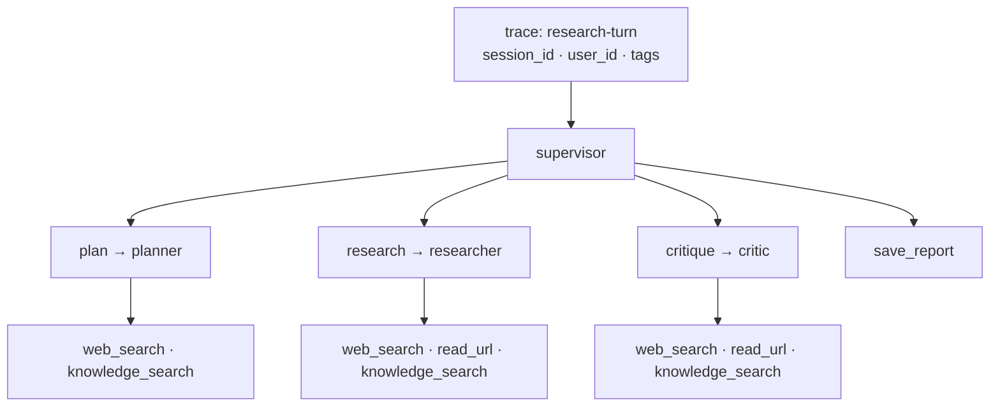

# Research Team with Observability

The same multi-agent research system as `research-multi-agent-team` — a Supervisor coordinating a
Planner, a Researcher and a Critic over a web + local-RAG toolset, with human approval before a
report is written — running under Langfuse: every turn is one trace, all four system prompts are
served from Prompt Management, and two LLM-as-a-Judge evaluators score traces as they arrive.

## Setup

```bash
python3 -m venv .venv
source .venv/bin/activate
pip install -r requirements.txt
cp .env.example .env
# fill in OPENAI_API_KEY and the LANGFUSE_* keys in .env
```

`data/` and `index/` ship with this copy, so `python ingest.py` is only needed if you change the
corpus. Langfuse keys come from **Settings → API Keys**; a base URL from the wrong region fails
with a 401, not a 404.

## Prompts

`prompts.py` holds the four prompt names and `load_prompt()`, which fetches a prompt at the label
in `settings.prompt_label` and fills its `{{variables}}`.

| Prompt name | Agent | Variables |
|---|---|---|
| `research_planner_system` | `agents/planner.py` | — |
| `research_researcher_system` | `agents/research.py` | — |
| `research_critic_system` | `agents/critic.py` | `today` |
| `research_supervisor_system` | `supervisor.py` | `max_revision_rounds` |

## Tracing

`observability.py` sets Langfuse up in one place: credentials into the environment, the client and
the `CallbackHandler`, and one `SESSION_ID` per process.



## Evaluators

| Evaluator | Score type | Judges | Rationale |
|---|---|---|---|
| `citation-grounding` | numeric, 0–1 | share of claims carrying an inline source (URL, or file + page) | Nothing else checks that citations survive into the supervisor's composed report |
| `request-coverage` | categorical: `complete` / `partial` / `off_topic` | whether the report answers the original request | Revision rounds pull the report toward the critic's feedback and away from the question |

## Run

```bash
source .venv/bin/activate && python main.py
```

The REPL prints its `Langfuse session:` id on start. Terminal output is truncated per line; the
full trace is written next to each saved report as `<report>.log`.

## Screenshots

1. **Tracing → Traces** — a `research-turn` trace expanded into supervisor → plan/research/critique → tool calls
2. **Sessions** — the session with all its traces
3. A trace's **Scores** tab, showing both evaluators
4. **Prompts** — the four prompts at label `production`

## Layout

```
observability.py      (new) Langfuse client, callback handler, session/user identity
prompts.py            prompt names and load_prompt()
main.py               REPL; traced turn, session attributes, HITL review
supervisor.py         supervisor agent, sub-agents as tools, HITL middleware
agents/               planner, researcher, critic
screenshots/          (new) Langfuse UI captures
config.py             settings and secrets
tools.py              save_report, web_search, read_url, knowledge_search
retriever.py          FAISS + BM25 ensemble, cross-encoder rerank
ingest.py             PDF -> chunks -> index/
schemas.py            ResearchPlan, CritiqueResult
```

## Configuration

Settings live in `config.py`; secrets in `.env`, never committed.

| Setting | Default | Meaning |
|---|---|---|
| `model_name` | `gpt-5.2` | model for all four agents |
| `prompt_label` | `production` | which prompt version `load_prompt()` fetches |
| `user_id` | `grigs` | `user_id` stamped on every trace |
| `langfuse_base_url` | `https://cloud.langfuse.com` | EU region; use `us.cloud.langfuse.com` for US |
| `max_revision_rounds` | `1` | revision loops before the supervisor saves anyway |
| `max_iterations` | `25` | sub-agent step budget |
| `retrieval_top_k` | `10` | candidates fetched before reranking |
| `rerank_top_n` | `3` | chunks kept after reranking |
