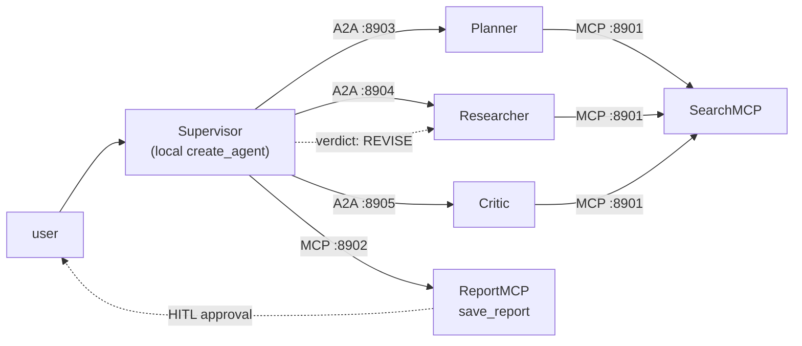
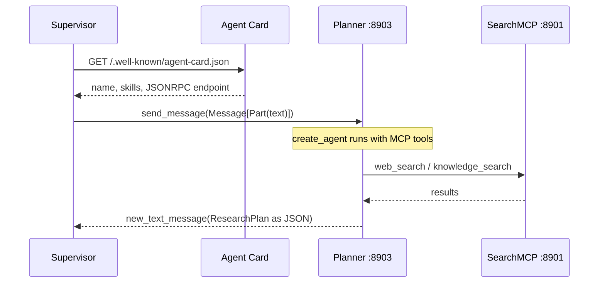
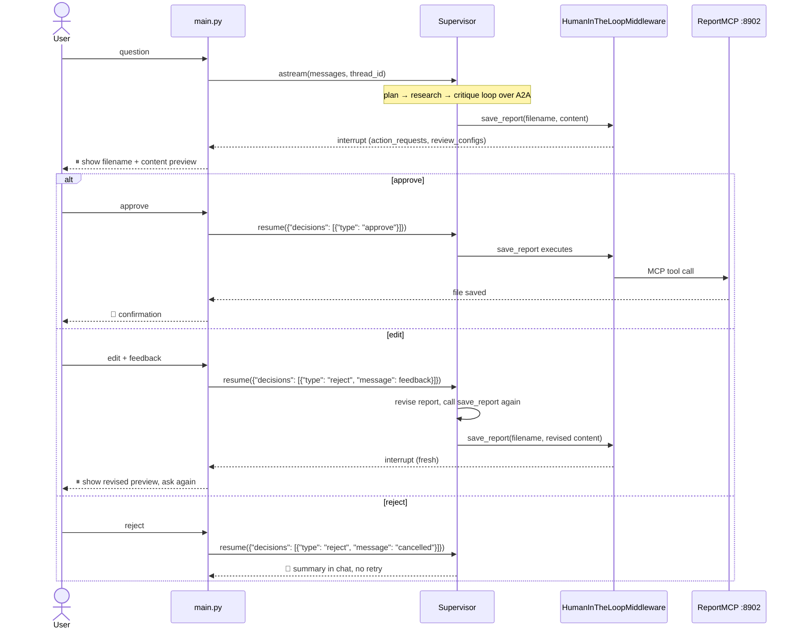

# Research Team over MCP + A2A

The same multi-agent research system as `research-multi-agent-team` — Supervisor coordinating
a Planner, a Researcher, and a Critic in an iterative plan → research → critique loop — but every
hop now runs over a protocol instead of a Python function call:

- **MCP** (Model Context Protocol) for tools: `web_search`, `read_url`, `knowledge_search` and
  `save_report` live in two FastMCP servers behind HTTP.
- **A2A** (Agent2Agent Protocol) for agents: each sub-agent is its own server with an Agent Card
  at `/.well-known/agent-card.json`.

The Supervisor stays a local `create_agent`: it is the orchestrator, not an A2A agent.

| Before (single process) | Now (protocols) |
|---|---|
| `tools.py` imported by every agent | Two MCP servers, one HTTP endpoint each |
| Sub-agents as `@tool` wrappers | Three A2A servers, one Agent Card each |
| Direct function calls | Discovery → delegate → collect over HTTP |
| One `python main.py` | Four processes: 2 MCP + 3 A2A (one process) + REPL |

## Setup

```bash
python3 -m venv .venv
source .venv/bin/activate
pip install -r requirements.txt
cp .env.example .env
# fill in OPENAI_API_KEY in .env
```

Build the knowledge base index (once, or whenever `data/` changes):

```bash
python ingest.py
```

## Run

Four terminals, in this order — each server must be up before the next connects to it.

```bash
python mcp_servers/search_mcp.py   # 1. SearchMCP  :8901
```

```bash
python mcp_servers/report_mcp.py   # 2. ReportMCP  :8902
```

```bash
python a2a_servers.py              # 3. Planner :8903, Researcher :8904, Critic :8905
```

```bash
python main.py                     # 4. Supervisor REPL
```

`main.py` checks all five endpoints before the first prompt and names the missing one if a server
is down. Then enter a question, watch the trace as the Supervisor delegates to each agent, and
approve, edit, or reject the report before it is saved. The terminal trace is truncated per line to
stay readable; once a report is approved, the full untruncated trace for that turn is saved next to
it as `<same name>.log`.

## Endpoints

| MCP server | Port | Tools | Resources |
|---|:---:|---|---|
| SearchMCP | 8901 | `web_search`, `read_url`, `knowledge_search` | `resource://knowledge-base-stats` |
| ReportMCP | 8902 | `save_report` | `resource://output-dir` |

| A2A agent | Port | Skill | Tools taken from SearchMCP |
|---|:---:|---|---|
| Planner | 8903 | `plan` | `web_search`, `knowledge_search` |
| Researcher | 8904 | `research` | `web_search`, `read_url`, `knowledge_search` |
| Critic | 8905 | `critique` | `web_search`, `read_url`, `knowledge_search` |

One SearchMCP serves all three agents; each takes only the tools its `AgentSpec` names, and each
publishes its skill in its Agent Card at `/.well-known/agent-card.json`.

MCP resources are application-controlled, so no agent reads them: `main.py` does, on startup, to
print how many documents the knowledge base holds and where reports go.

## Architecture



- **Planner** → `ResearchPlan`: goal, search queries, sources to check.
- **Researcher** executes the plan against the web and the hybrid-retrieval knowledge base.
- **Critic** re-verifies findings through the same sources and returns `CritiqueResult` — a verdict
  on freshness, completeness, and structure. On `REVISE`, the Supervisor sends its feedback back to
  the Researcher, capped at `max_revision_rounds` rounds.
- Supervisor then calls `save_report` on ReportMCP, gated on human approval.

A2A carries text, but the Planner and the Critic use `response_format`. `LangChainAgentExecutor`
serializes `structured_response` to JSON before enqueuing it, so the Supervisor still receives the
validated model rather than a prose summary of it.

## Flow: A2A delegation



`create_client` handles discovery and transport selection: it fetches the Agent Card itself, so the
Supervisor only ever names a base URL.

## Flow: HITL approval



`edit` isn't the middleware's own `edit` decision (that would replace the tool args directly,
skipping the revision step) — both `edit` and `reject` resolve to a `reject` decision with different
messages; only the message tells the Supervisor whether to revise or give up.

The middleware gates by tool name, and MCP tools arrive through `langchain-mcp-adapters` as ordinary
LangChain tools, so `interrupt_on={"save_report": True}` works unchanged even though `save_report`
now runs in a separate process.

## Layout

```
main.py            REPL: preflight, HITL interrupt/resume loop, trace log
supervisor.py      Supervisor agent + A2A delegation tools + save_report from ReportMCP
a2a_servers.py     LangChainAgentExecutor, Agent Cards, three uvicorn servers
mcp_servers/
  search_mcp.py    SearchMCP: web_search, read_url, knowledge_search
  report_mcp.py    ReportMCP: save_report
agents/
  spec.py          AgentSpec: Agent Card fields, tool subset, port
  planner.py       prompt + response_format + spec
  research.py
  critic.py
schemas.py         ResearchPlan, CritiqueResult
config.py          settings, ports, endpoint URLs
prompts.py         all four agents' system prompts
retriever.py       hybrid retrieval + reranking (unchanged)
ingest.py          PDF → chunks → FAISS index (unchanged)
```

## Configuration

`config.py` holds settings and ports; `prompts.py` holds the prompts. Secrets are read from `.env`
(template: `.env.example`) and never committed.

| Setting | Default | Meaning |
|---|---|---|
| `model_name` | `gpt-5.2` | Chat model |
| `host` | `127.0.0.1` | Bind address for every server |
| `search_mcp_port` / `report_mcp_port` | `8901` / `8902` | MCP servers |
| `planner_port` / `researcher_port` / `critic_port` | `8903` / `8904` / `8905` | A2A agents |
| `a2a_timeout` | `300` | Seconds to wait on one delegation — a research round is not a fast call |
| `max_revision_rounds` | `2` | Research↔critique cycles before proceeding anyway |
| `max_iterations` | `25` | Sub-agent tool-calling budget |
| `retrieval_top_k` | `10` | Hybrid retrieval candidates before reranking |
| `rerank_top_n` | `3` | Chunks kept after cross-encoder reranking |
