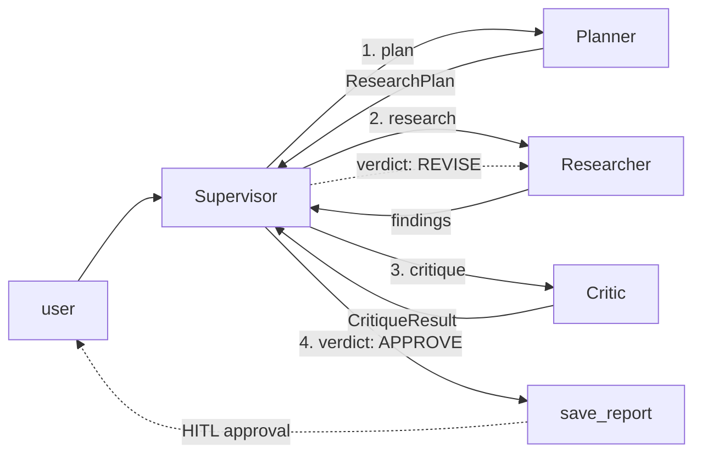
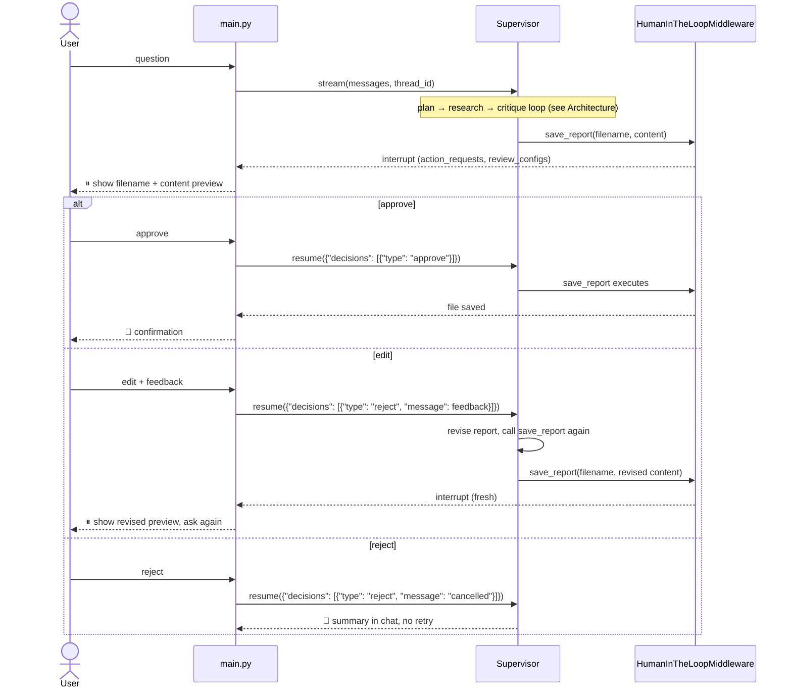

# Research Team

A multi-agent research system: a Supervisor coordinates a Planner, a Researcher, and a
Critic in an iterative plan → research → critique loop, then saves the final report
only after the user approves it. Extends the single-agent Research Agent with
independent sub-agents instead of one agent doing everything.

## Setup

```bash
python3 -m venv .venv
source .venv/bin/activate
pip install -r requirements.txt
cp .env.example .env
# fill in OPENAI_API_KEY in .env
```

Build the knowledge base index (once, or whenever `data/` changes):

```bash
python ingest.py
```

## Run

```bash
source .venv/bin/activate && python main.py
```

Enter a question, watch the trace as the Supervisor calls each sub-agent, then approve,
edit, or reject the report before it's saved. The terminal trace is truncated per line to
stay readable; once a report is approved, the full untruncated trace for that turn is
saved next to it as `<same name>.log`.

## Architecture



Planner, Researcher, and Critic are each a separate agent, wrapped as a tool the
Supervisor calls — each sees only the request it's given, not the Supervisor's full
conversation. The Supervisor never researches anything itself; it only calls tools and
synthesizes their output.

- **Planner** → `ResearchPlan`: goal, search queries, sources to check.
- **Researcher** executes the plan using `web_search`, `read_url`, and
  `knowledge_search` (the same hybrid-retrieval knowledge base as the base Research
  Agent).
- **Critic** independently re-verifies findings through the same sources and returns a
  structured verdict (`CritiqueResult`) on freshness, completeness, and structure. On
  `REVISE`, the Supervisor sends its feedback back to the Researcher, capped at
  `max_revision_rounds` rounds.
- Supervisor then calls `save_report`, gated on human approval: `approve` saves,
  `edit` sends feedback back for revision, `reject` cancels.

## Flow: HITL approval



`edit` isn't the middleware's own `edit` decision (that would replace the tool args
directly, skipping the revision step) — both `edit` and `reject` resolve to a `reject`
decision with different messages; only the message tells the Supervisor whether to
revise or give up.

## Configuration

`config.py` holds settings; `prompts.py` holds all four agents' system prompts.
Secrets are read from `.env` (template: `.env.example`) and never committed.

| Setting | Default | Meaning |
|---|---|---|
| `model_name` | `gpt-5.2` | Chat model |
| `max_revision_rounds` | `2` | Research↔critique cycles before proceeding anyway |
| `max_iterations` | `25` | Sub-agent tool-calling budget |
| `retrieval_top_k` | `10` | Hybrid retrieval candidates before reranking |
| `rerank_top_n` | `3` | Chunks kept after cross-encoder reranking |
